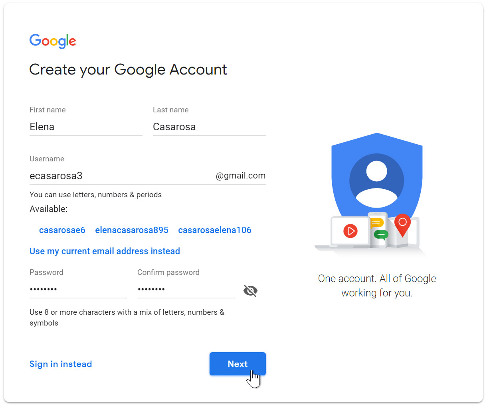
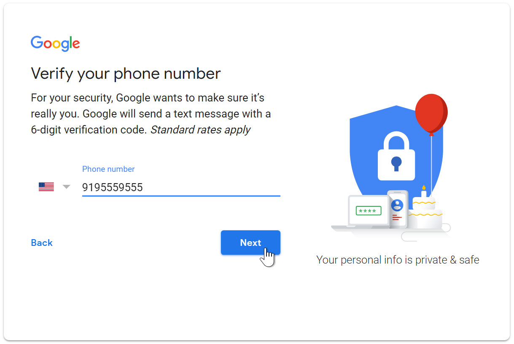
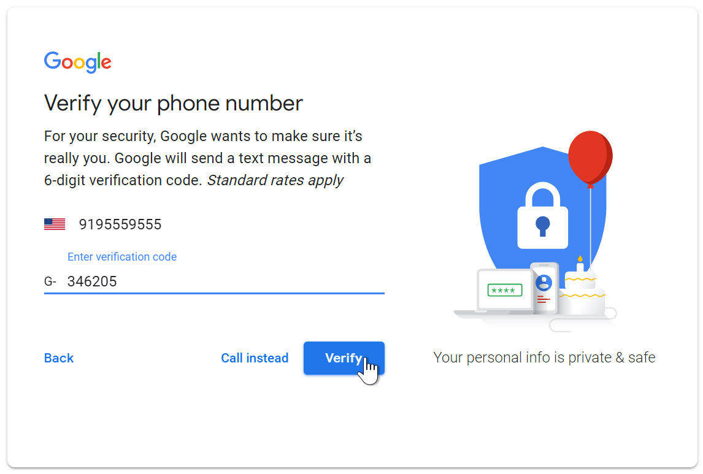
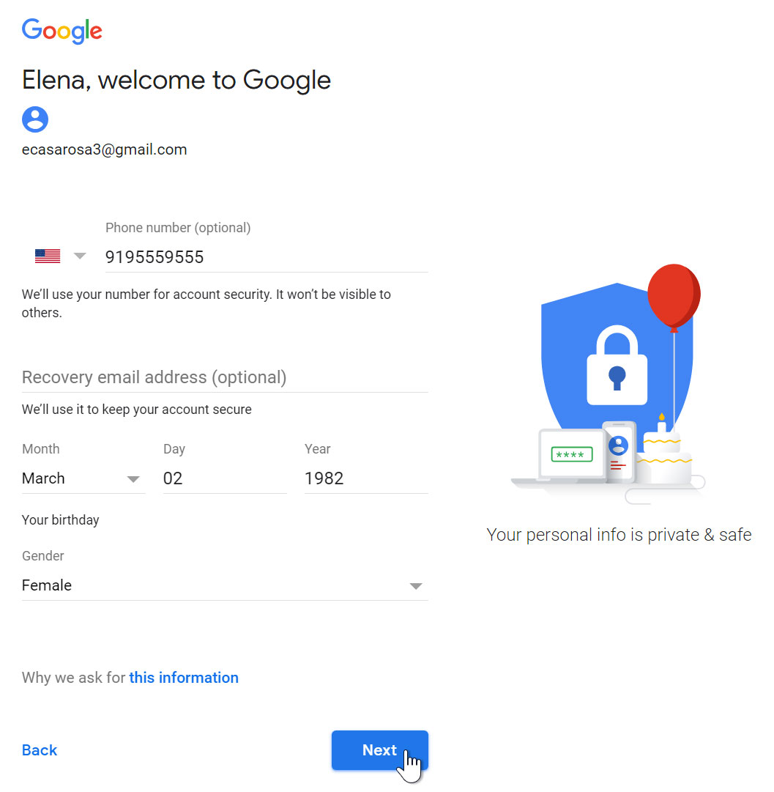
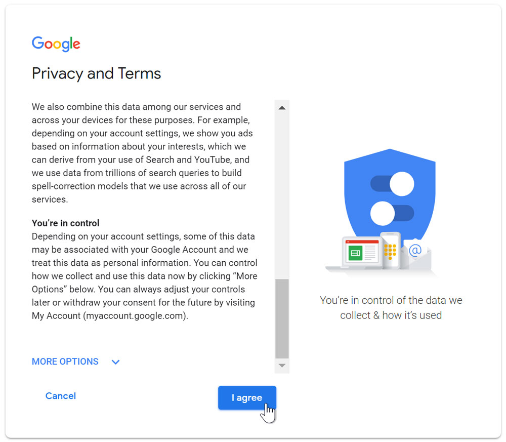
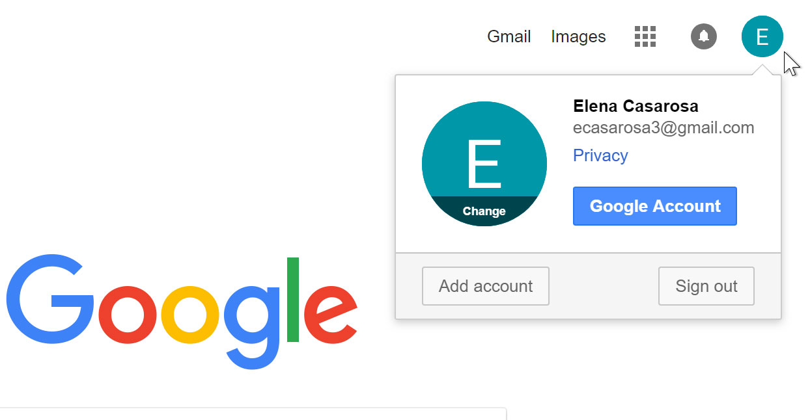

 Introduction  
Setting up a Gmail account is easy. You will begin by creating a Google account, and  during the quick sign-up process you will choose your Gmail account name. In this lesson, we'll show you how to set up your Google account for Gmail, add and edit contacts, and edit your mail settings.  

Setting up a Gmail account  
To create a Gmail address, you'll first need to create a Google account. Gmail will  redirect you to the Google account sign-up page. You'll need to provide some basic information like your name, birth date, gender, and location. You will also need to choose a name for your new Gmail address. Once you create an account, you'll be able to start adding contacts and adjusting your mail settings.  

To create an account:  
* Go to www.gmail.com.
* Click Create account. 

 
* The sign-up form will appear. Follow the directions by entering the required information. 
 
* Next, enter your phone number to verify your account. Google uses a two-step verification process for your security. 
 
* You will receive a text message from Google with a verification code. Enter the code to complete the account verification. 
 
* Next, you will see a form to enter some of your personal information, like your name and birthday. 
 
* Review Google's Terms of Service and Privacy Policy, then click I agree. 
 
* Your account will be created.
 
Just like with any online service, it's important to choose a strong password—in other words, one that is difficult for someone else to guess. For more information, review our lesson on creating strong passwords.
---
****
