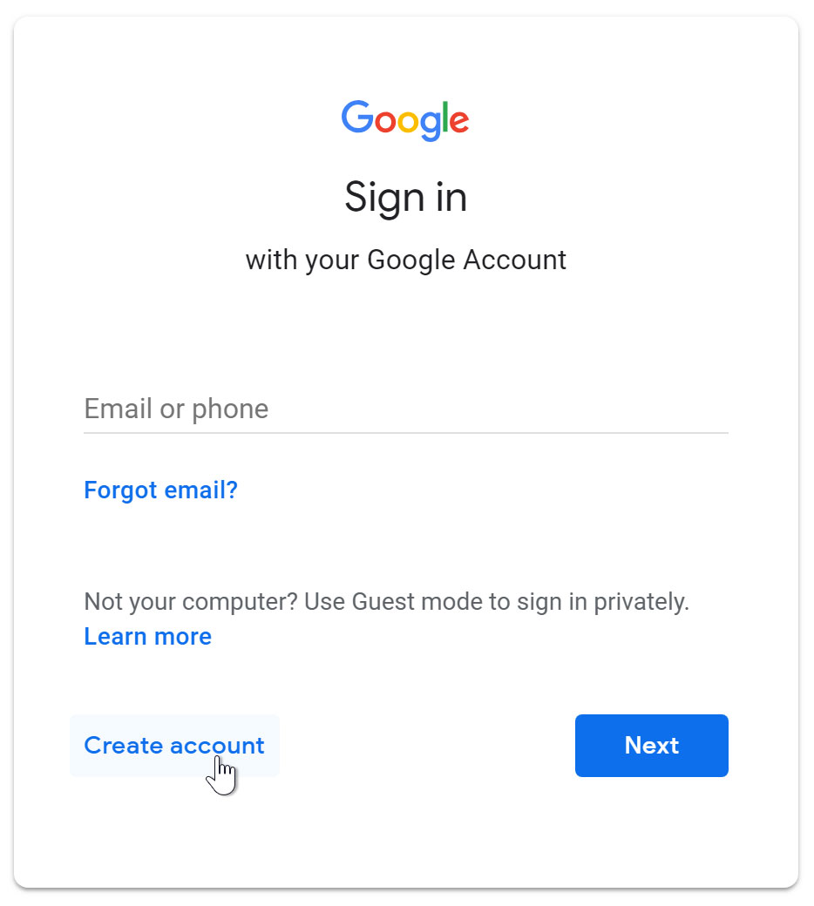

Introduction 
Setting up a Gmail account is easy. You will begin by creating a Google account, and   during the quick sign-up process you will choose your Gmail account name. In  this lesson, we'll show you how to set up your Google account for Gmail, add and edit   contacts, and edit your mail settings.

Setting up a Gmail account 
To create a Gmail address, you'll first need to create a Google account. Gmail will   redirect you to the Google account sign-up page. You'll need to provide some  basic information like your name, birth date, gender, and location. You will also  need to choose a name for your new Gmail address. Once you create an account,  you'll be able to start adding contacts and adjusting your mail settings.

To create an account: 
* Go to www.gmail.com.
* Click Create account.

---
****
